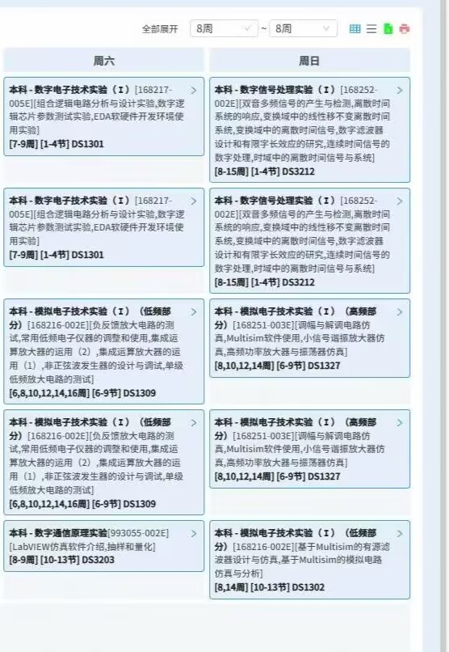

# 学分认证与补课

## 一、学分认证

### 1、学分认证简介

学分认证是转专业成功后的固定环节。在《关于开展2025年本科生转专业工作的通知》中，有以下描述：
> *"经批准转专业的学生，需到转入学院教务办公室报到并进行学分认证"。*

简单来说，学分认证主要指，由于原专业与新专业的培养方案通常是不同的，在学籍异动后，需要将在原专业取得的部分学分认证到新专业中去，以减轻学生的补课压力。

### 2、学分认证流程

每一门课程都有唯一的课程代码，课程代码是课程的唯一标识而非课程名。下面介绍您在原专业已经取得学分的课程是如何被认定到新专业的。

#### 培养方案内代码相同课程
首先，在原专业与新专业的培养方案中，课程代码完全重叠的课程，在学籍异动时会在系统中被自动认定过去，这一过程通常不能被人为干涉。如果您希望在后续的学习过程中提高这门课的分数，您可以通过课程刷新来重新修读这门课程。需要再次提醒的是，**刷新课程的时间冲突是被严格禁止的**，在任何学院的任何教务都完全没有商量的余地。因此，选择平转的同学们几乎就与课程刷新无缘了。

#### 不在培养方案内的课程
剩余的课程，即您在原专业已经取得学分但新培养方案里没有的课程，会先被列入[教务系统-个人修读情况]中最下面"未认定课程情况"一栏中。这些课程就是实际上需要在学院的教务老师处进行学分认证的课程，下面用"未认定课程"指代这些课程。

以软院为例，这一部分的经验流程如下：~~请注意，该环节中，您与学院教务进行亲切友好的漫长交流将会起到显著的有效作用~~

1. 学院教务通知学生到教务处处理相关事项，并发放之前的认证成绩单。
2. 教务老师根据往年认证经验或学院规则，告知学生一部分可认证课程与不可认证课程。
3. 学生提出异议后，学院教务可能与学院领导或者学校教务进行沟通询问，给出最终认证方案。
4. 学生逐一在成绩单上注明认证细则，后交付教务老师登入系统。

通常，您可以将不在以上两种情况中的部分课程认证为"非限制性选修课程"，从而变相减轻选修非限的压力。需要注意的是，这种认定具有以下两种限制：

- **认证为非限的课程是有某种上限的：**比如在某些学院，您可能最多只能最多将6学分的课程认证为"非限"，也可能最多只能挑选一门课程，将其认证为"非限"。其余课程的课程类型将变为"任选课程"，
- **公共基础课程不能被认证为非限：**在某些学院中，类别为公共基础课程的课程不能被认证为非限，而其余的，例如大类基础课程，是可以被认证为非限的。

不在以上情况中的课程会被列入[教务系统-个人修读情况]中最下面"任选课程"一栏中，其成绩不再影响您的绩点。

#### 认证规则:material-tooltip-plus-outline: :material-tooltip-edit-outline:
关于具体原专业的哪些课程可以被认证到新专业中，不同学院的处理方式略有差异。以下是目前收录的一部分学院认证规则（包含一部分不能被认证的案例）：

=== "通院"
    **复变函数** `MATH20051` (2学分) →:fontawesome-regular-face-smile:→ **复变函数与积分变换** `MATH20050` (3学分)

    **金工实习（Ⅰ）** `ENGR14000` →:fontawesome-regular-face-smile:→ **电子实习** `ICE25102`

    **机器人技术前沿** `ME20671` →:fontawesome-regular-face-smile:→ **工程师职业素养** `CSE10011`

    **工程学导论** `SEM8807` →:fontawesome-regular-face-smile:→ **新生研讨课** `SEM8804`

    **电路原理（Ⅲ）** `EE21040` →:fontawesome-regular-face-smile:→ **电路原理（I-1）** `EE11040`

=== "软院"
    **机器人技术前沿** `ME20671` →:fontawesome-regular-face-smile:→ **工程师职业素养** `CSE10011`

    **工程学导论** `SEM8807` →:fontawesome-regular-face-smile:→ **新生研讨课** `SEM8804`

    **程序设计技术（基于C）** `CST11012` →:fontawesome-regular-face-smile:→ **程序设计基础** `CST11103`

    **程序设计技术（基于C++）** `CST11012` →:fontawesome-regular-face-smile:→ **程序设计基础** `CST11103`

    **程序设计技术（基于Python）** `CST11012` →:fontawesome-regular-face-dizzy:→ **程序设计基础** `CST11103`

    **数据结构** `CSE20010` →:fontawesome-regular-face-dizzy:→ **数据结构与算法** `SE21014`

特别的，由于课程分数等原因，如果您不想将某门"未认定课程"认定为新培养方案中内容相似的另一门课程，部分学院支持您不进行这样的认定，改为将其认定成任选类型。
???+ example 
    通信学院有过允许不将**模拟电子技术（Ⅱ）** `EE21100`认定为**模拟电子技术（II）（低频部分）** `ICE20101`，而是将其认定为"任选"的先例，以使该同学实现重新学习**模拟电子技术（II）（低频部分）** `ICE20101`，尝试获得更好成绩的目的。如果您希望这样操作，需要注意以下几点：

    - 这种机会只存在于"未认定课程"中，课程代码完全相同的课程会被自动认定，无法进行此操作；
    - 需要在学院教务处理课程认定时，主动提出此请求，因为这通常不是教务老师默认的处理方式；
    - 这会导致您需要补更多的课程，可能会增加您的补课负担；
    - 重新学习不代表您一定能取得更高的成绩，其中存在一定风险，请您充分考虑。 

提前了解新培养方案的哪些课程可以用您的旧培养方案中的课程认定，对于评估转入后补课的压力是非常有益的，但需要注意不同学院和专业的课程认定的宽松程度可能存在差异。

此外，这里再次重复，在原专业与新专业的培养方案中，课程代码完全重叠的课程，在学籍异动时会在系统中被自动认定过去，没有选择的余地。这意味着某些本可能可以被认定为新培养方案里的必修课的课程，会由于新培养方案中将该课程列为了选修，导致它被自动认定，无法进入"未认定课程"的行列中，也就无法认定成其他课程。
???+ example
    比如，**程序设计技术（基于Python）** `CST11012`是通信学院的2022-2023级各专业的培养方案中的一门选修课，因此如果您转入通信学院且在原专业学了该课程，学籍异动后该课程将自动被认定到新培养方案中，这意味着它不会出现在"未认定课程"一栏中，因此您无法将它认定为**程序设计基础** `CST11103`，换言之您转入后就需要补**程序设计基础** `CST11103`这门课程。
    
    特别的（以下纯猜测，是否可行请询问教务），如果您转入通信学院且计划从23级降至24级，由于通信学院2024级各专业的培养方案中不再将**程序设计技术（基于Python）** `CST11012`作为选修，而是将**Python程序设计技术（II）** `CST11025`作为选修，可能您在降级后进行的学分认证中可以将**Python程序设计技术（II）** `CST11025`认证为**程序设计基础** `CST11103`，使您又无需补**程序设计基础** `CST11103`这门课程了。 :material-alert-decagram:

### 3、学分认证的用时

需要注意的是，由于学分认证需要学校审核，认证并不是您在学院教务老师处认定后立刻完成的，而是需要等待一段时间，可能为几个月。

学分认证完成的标志是，[教务系统-个人修读情况]中最下面"未认定课程情况"一栏中不再有课程。在学分认证彻底完成之前，教务系统显示的绩点将计入所有的课程成绩，包括被认证为"任选"的那些课程。在学分认证完成之后，教务系统中您的绩点将不再受被认证为"任选"的那些课程影响。因此通常在学分认证完成后，您在教务系统中的绩点和排名会发生一次改变。

## 二、补课

### 1、补课的负担

补课的负担通常是难以预料的。不同学院补课造成的具体负担各有不同，但带来的劳累颇为相近。

比如，下图为某位22级转入电子信息工程专业的同学在大三上第8周的周末的课表。 

### 2、从底层缓解补课负担的方式

主要包括降级和辅修。前者参考[转专业后的安排-降级](6.%20转专业后的安排.md/#_2)，后者参考[准备工作与报名-辅修](4.%20报名与准备工作.md/#_2)。

### 3、补课须知

即使降级，补课也可能无法完全避免。下面将介绍关于补课您需要了解的内容，解释一些有时会被误解的地方。

①补课的流程：首先需要通过培养方案（参考【流程概览】中的【培养方案的阅读】）和[教务系统-个人修读情况]（注：[教务系统-个人修读情况]内容的更新不是实时的，有时学籍异动后，如降级后，需第二天才会更新）了解自己需要补的课程。培养方案中被安排在单数学期（秋季学期）的大部分课程只会在秋季学期开设，因此您无法在大二下学期补大二上学期开设的大部分课程。培养方案中被安排在双数学期（春季学期）的大部分课程亦然。只有个别课程会同时在秋季学期和春季学期开设。因此，如果您选择不降级且希望保研，通常您在大三上会面临最大的补课压力，因为届时您既需要完成大三上的课程，又需要补培养方案中第三学期和第一学期的部分课程。

②如何选课：当学期的课程，在选课页面可以正常选择。如果需要跨年级选课，则需要通过"特殊选课申请"进行申请。需要注意的是，特殊选课申请只能为您提供一个选择无法在选课页面选择的其他课程的渠道，能帮您申请到有课程冲突的课程，并不能帮您选到已经满了的课程。另外，在您刚刚转入新专业后，您之前选择的旧专业的课程通常需要您手动退掉。

③课程冲突：课程冲突造成的问题主要是两方面，一方面是影响能不能选到课，一方面是影响课程的学习和课程得分。关于如何选到课，通常情况下，教务会尽全力保障您完成您的培养方案，因此通常不会出现您选不到必修课的情形。但是，根据有关规定和流程的要求，为了选课申请被通过，可能需要您在特殊选课申请时，找任课老师填写"重庆大学选课申请表"，并明确给出解决课程冲突的方式，否则您的申请可能被驳回。具体的要求不同学院是不同的，请您询问您转入学院的教务。关于课程的学习和课程得分，则需要您和相应的任课老师商量您的成绩占比、交作业的方式等，且通常您需要自学某些课程。特别的，如果您遇到了刚刚转入后体育课与专业课冲突的情形，通常可以采用以下两种方式解决：a.用特殊退课申请将体育课退掉（这是因为通常体育课的退课是锁定的，您无法直接在选课页面退掉体育课），之后选择其他时间不冲突的班级，但通常您能选择的班级有限的，因为大部分班级名额通常是满的;b.如果您的体育老师有其他时间的教学班，即使这些教学班在系统中可能已满，但您可以尝试与您的体育老师协商，私下调换时间。

④课程名额已满的解决方式：如果课程名额满了，需要您联系负责选课的教务老师申请扩充名额，对于必修课程，扩充名额的请求通常会被同意。

⑤如何选到想要选的老师：在转入专业后，通常会出现课程只剩下一个教学班可选的尴尬境地。您可以尝试联系负责选课的教务老师，询问能否扩充教学班名额，有一定的概率会被同意。比如，通信学院有过在部分教学班未完全选满的情况下扩充已满的教学班的名额的先例。另一种您选到想选的老师的可能是，如果课程名额已满，在扩充名额时，通常所有教学班的名额都会被扩充（除非受到教室容量上限的影响），此时您就有概率选到您想选的老师。

⑥补课的期限：对于希望保研的同学来说，您需要在大三时学完前三年的全部必修课程，而对于无需保研的同学来说，您可以用大四补课，因此如果您无需保研，即使您需要补的课较多，也通常不需要降级就能补完课，且将有较小的补课压力。这将是评估补课压力和是否降级的重要参考。

⑦关于学分上限：通常情况下，一个学期可选的学分是有上限的。但对于转专业的同学来说，可以在一定程度上突破这一上限。需要注意的是，这种突破不是无限的。关于具体能提高到多少需要以及提高是否需要向教务申请，请询问转入学院的教务。比如，通信学院的教务曾采用过发布关于提高学分上限申请的在线文档的方式，供转专业的同学申请填写，有过扩充5.5学分的先例。（注：也可能为6.5，记不清了） :material-alert-decagram:

⑧补课的顺序：补课的顺序完全由您自己设计和决定。理论上，即使是当学期的必修课程，因为某些原因，您也可以先不选，而是等到一年后再选择并修读（通常这会发生在降级的同学身上）。此外，需要注意的是，请您密切关注培养方案和个人修读情况，避免出现漏掉的课程。特别的，对于希望保研的同学，《重庆大学推荐优秀应届本科毕业生免试攻读研究生工作管理办法》明确指出，想要获得推免资格必须"按期完成前三学年（四年制）或者前四学年（五年制）本专业人才培养方案规定的课程及实践环节的学分要求（外语类、体育类课程应获得毕业要求的规定学分），且参加全国大学外语四级考试成绩达到425分及以上（体育、艺术类专业全国大学外语四级考试成绩不作要求），或者参加托福考试成绩≥80分，或者参加雅思考试成绩≥5.5 分。外语类专业学生应通过外语专业四级考试。"通信学院曾有过因为没有修读完英语课程毕业要求的规定学分导致在初审环节即失去推免资格的先例。

⑨慎重选课：即使您不打算降级，也请您不要在选课时直接把所有必修课全部选上，而是留意一下课程的开课时间。由于转专业通过通常是学期的第2-3周，而不是在学期开始前，因此当学籍异动之后，可能有些课程已经结束或即将结束，此时您就不应当选择这些课程，而是应当将其放到一年后再去补，否则将会出现不幸。比如，通信学院的**数字电子技术设计与实践（Ⅰ）** `ICE25002`课程通常会被安排在第4学期的第1-2周进行，因此如果您刚刚转入了通信学院，请千万不要选择该课程，因为当您转入后，该课程已经结束或即将结束，您几乎无法在当学期完成该课程，只能在一年后用补课的方式解决。