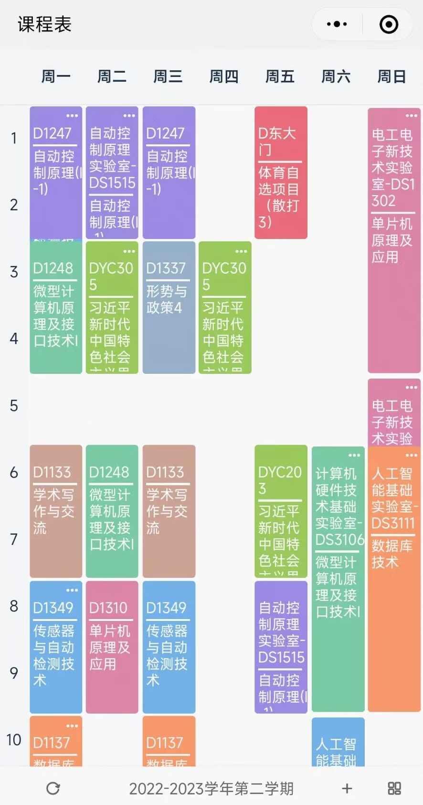
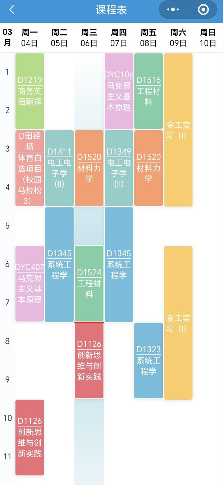

# 学分认证与补课

## 一、学分认证

### 1、学分认证简介

学分认证是转专业成功后的固定环节。在《关于开展2025年本科生转专业工作的通知》中，有以下描述：
> *"经批准转专业的学生，需到转入学院教务办公室报到并进行学分认证"。*

简单来说，学分认证主要指，由于原专业与新专业的培养方案通常是不同的，在学籍异动后，需要将在原专业取得的部分学分认证到新专业中去，以减轻学生的补课压力。

认证前，您的个人修读情况应该与下图类似：

### 2、学分认证流程

每一门课程都有唯一的课程代码，课程代码是课程的唯一标识而非课程名。下面介绍您在原专业已经取得学分的课程是如何被认定到新专业的。

#### 培养方案内代码相同课程
首先，在原专业与新专业的培养方案中，课程代码完全重叠的课程，在学籍异动时会在系统中被自动认定过去，这一过程通常不能被人为干涉。如果您希望在后续的学习过程中提高这门课的分数，您可以通过课程刷新来重新修读这门课程。需要再次提醒的是，**刷新课程的时间冲突是被严格禁止的**，在任何学院的任何教务都完全没有商量的余地。因此，选择平转的同学们几乎就与课程刷新无缘了。

还有一点值得注意的是，只有代码完全相同的课程可以被自动认证到新专业的培养方案内。而两门名称完全相同，即使学习内容也完全相同的课程，也不一定会被新学院认证，虽然大部分情况下这些课程能够被认证。

#### 不在培养方案内的课程
剩余的课程，即您在原专业已经取得学分但新培养方案里没有的课程，会先被列入[教务系统-个人修读情况]中最下面"未认定课程情况"一栏中。这些课程就是实际上需要在学院的教务老师处进行学分认证的课程，下面用"未认定课程"指代这些课程。

以软院为例，这一部分的经验流程如下：~~请注意，该环节中，您与学院教务进行亲切友好的漫长交流将会起一定的一定作用~~

1. 学院教务通知学生到教务处处理相关事项，并发放之前的认证成绩单。
2. 教务老师根据往年认证经验或学院规则，告知学生一部分可认证课程与不可认证课程。
3. 学生提出异议后，学院教务可能与学院领导或者学校教务进行沟通询问，给出最终认证方案。
4. 学生逐一在成绩单上注明认证细则，后交付教务老师登入系统。

通常，您可以将不在以上两种情况中的部分课程认证为"非限制性选修课程"，从而变相减轻选修非限的压力。需要注意的是，这种认定具有以下两种限制：

- **认证为非限的课程是有某种上限的：**比如在某些学院，您可能最多只能最多将6学分的课程认证为"非限"，也可能最多只能挑选一门课程，将其认证为"非限"。其余课程的课程类型将变为"任选课程"，
- **公共基础课程不能被认证为非限：**在某些学院中，类别为公共基础课程的课程不能被认证为非限，而其余的，例如大类基础课程，是可以被认证为非限的。

不在以上情况中的课程会被列入[教务系统-个人修读情况]中最下面"任选课程"一栏中，其成绩不再影响您的绩点。

#### 认证规则:material-tooltip-plus-outline: :material-tooltip-edit-outline:
关于具体原专业的哪些课程可以被认证到新专业中，不同学院在不同时间的处理方式会存在较大差异。以下是目前收录的一部分学院认证规则（包含一部分不能被认证的案例）：

=== "通院"
    **复变函数** `MATH20051` (2学分) →:fontawesome-regular-face-smile:→ **复变函数与积分变换** `MATH20050` (3学分)

    **金工实习（Ⅰ）** `ENGR14000` →:fontawesome-regular-face-smile:→ **电子实习** `ICE25102`

    **机器人技术前沿** `ME20671` →:fontawesome-regular-face-smile:→ **工程师职业素养** `CSE10011`

    **工程学导论** `SEM8807` →:fontawesome-regular-face-smile:→ **新生研讨课** `SEM8804`

    **电路原理（Ⅲ）** `EE21040` →:fontawesome-regular-face-smile:→ **电路原理（I-1）** `EE11040`

=== "软院"
    **机器人技术前沿** `ME20671` →:fontawesome-regular-face-smile:→ **工程师职业素养** `CSE10011`

    **工程学导论** `SEM8807` →:fontawesome-regular-face-smile:→ **新生研讨课** `SEM8804`

    **程序设计技术（基于C）** `CST11012` →:fontawesome-regular-face-smile:→ **程序设计基础** `CST11103`

    **程序设计技术（基于C++）** `CST11012` →:fontawesome-regular-face-smile:→ **程序设计基础** `CST11103`

    **程序设计技术（基于Python）** `CST11012` →:fontawesome-regular-face-dizzy:→ **程序设计基础** `CST11103`

    **数据结构** `CSE20010` →:fontawesome-regular-face-dizzy:→ **数据结构与算法** `SE21014`

特别的，由于课程分数等原因，如果您不想将某门"未认定课程"认定为新培养方案中内容相似的另一门课程，部分学院支持您不进行这样的认定，改为将其认定成任选类型。
???+ example 
    通信学院有过允许不将**模拟电子技术（Ⅱ）** `EE21100`认定为**模拟电子技术（II）（低频部分）** `ICE20101`，而是将其认定为"任选"的先例，以使该同学实现重新学习**模拟电子技术（II）（低频部分）** `ICE20101`，尝试获得更好成绩的目的。如果您希望这样操作，需要注意以下几点：

    - 这种机会只存在于"未认定课程"中，课程代码完全相同的课程会被自动认定，无法进行此操作；
    - 需要在学院教务处理课程认定时，主动提出此请求，因为这通常不是教务老师默认的处理方式；
    - 这会导致您需要补更多的课程，可能会增加您的补课负担；
    - 重新学习不代表您一定能取得更高的成绩，其中存在一定风险，请您充分考虑。 

提前了解新培养方案的哪些课程可以用您的旧培养方案中的课程认定，对于评估转入后补课的压力是非常有益的，但需要注意不同学院和专业的课程认定的宽松程度可能存在差异。

此外，这里再次重复，在原专业与新专业的培养方案中，课程代码完全重叠的课程，在学籍异动时会在系统中被自动认定过去，没有选择的余地。这意味着某些本可能可以被认定为新培养方案里的必修课的课程，会由于新培养方案中将该课程列为了选修，导致它被自动认定，无法进入"未认定课程"的行列中，也就无法认定成其他课程。
???+ example
    比如，**程序设计技术（基于Python）** `CST11012`是通信学院的2022-2023级各专业的培养方案中的一门选修课，因此如果您转入通信学院且在原专业学了该课程，学籍异动后该课程将自动被认定到新培养方案中，这意味着它不会出现在"未认定课程"一栏中，因此您无法将它认定为**程序设计基础** `CST11103`，换言之您转入后就需要补**程序设计基础** `CST11103`这门课程。
    
    特别的（以下纯猜测，是否可行请询问教务），如果您转入通信学院且计划从23级降至24级，由于通信学院2024级各专业的培养方案中不再将**程序设计技术（基于Python）** `CST11012`作为选修，而是将**Python程序设计技术（II）** `CST11025`作为选修，可能您在降级后进行的学分认证中可以将**Python程序设计技术（II）** `CST11025`认证为**程序设计基础** `CST11103`，使您又无需补**程序设计基础** `CST11103`这门课程了。 :material-alert-decagram:

### 3、学分认证的用时

需要注意的是，由于学分认证需要学校审核，认证并不是您在学院教务老师处认定后立刻完成的，而是需要等待一段时间，可能为几个月。

学分认证完成的标志是，[教务系统-个人修读情况]中最下面"未认定课程情况"一栏中不再有课程。在学分认证彻底完成之前，教务系统显示的绩点将计入所有的课程成绩，包括被认证为"任选"的那些课程。在学分认证完成之后，教务系统中您的绩点将不再受被认证为"任选"的那些课程影响。因此通常在学分认证完成后，您在教务系统中的绩点和排名会发生一次改变。

## 二、补课

### 1、补课的负担

再接下来的几年内，您将与如下丰满的美妙课表进行漫长的邂逅，尤其对于平转同学的大三上学期。您务必对未来的课程安排做好充足的心理准备。

### 2、从底层缓解补课负担的方式

主要包括降级和提前辅修。前者参考[转专业后的安排-降级](6.%20转专业后的安排.md/#_2)，后者参考[准备工作与报名-辅修](4.%20报名与准备工作.md/#_2)。

### 3、特殊选课与补修

#### 选课流程

首先，您需要**了解需要补的课程**：通过培养方案以及[教务系统-个人修读情况]页面，确认需要补修的课程。请注意，教务系统的信息更新可能存在延迟，尤其是在学籍异动后，如降级，需等待系统更新。

在了解需要补修的课程后，，对于在本学期开设的课程，则可直接在选课页面选择。而需要跨年级选课的课程，则要在智慧教务的特殊选课申请中提交选课申请，下图为特殊选课界面示例（特殊退课类似，这里不再赘述）：
   

#### 班级扩容
如图所示，在特殊选课开放的时间点，大部分班级都处于满额状况，如果不希望选择剩余的班级，您可以向教务申请扩容。在申请扩容的时候，您需要注意以下几点：

- **班级扩容的主要阻力来源于教室容量大小：**如果一个班级的容量达到了其教室的容量上限，那么即使是对应学院教务也是无权扩容对应班级的，只能期待该班级更换容量更大的教室，而这种情况一般只在该课程扩容需求很大时发生。如果教室容量仍在系统规定的范围之内，则不超过系统规定的扩容请求一般会被通过。
- **需要联系对应开课学院的教务：**如果是您本学院开设的课程需要扩容，您的扩容需求一般很容易通过，尤其对于必修课而言。如果您期望扩容的课程并非本学院开设，则您需要联系对应开课学院的教务老师进行扩容，该申请的通过可能就不如前者。

!!! note
    一般而言，专业课的扩容需求通常会被通过，无论您是否指定特定班级。而基础课的扩容需求一般很难通过，尤其是目前开设的班级中仍有空余时。

#### 课程冲突处理
对于降转的同学而言，稀释课程密度和避免课程冲突的难度相对较小，我们建议有能力的同学尽可能避免课程冲突，以取得更好的学习条件。
如果您选择的课程在时间安排上发生了冲突，则您需要重新审视您的课程时间安排，就往年的经验而言，我们总结了下面几种应对课程冲突的方法：

- **调整并重新安排课程时间段：**有一部分课程会开设在多个时间段，比如体育、英语、思政和部分专业基础课程。您可以通过调整这些时间较自由的课程的时间段来为开设在单一时间段的课程腾出时间。这需要您非常熟悉课程的开设时间。
  
???+ tip
    上下学期绑定的选课可以通过特殊退课退掉，并通过特殊选课选择其他的任课老师。但注意，这一流程可能耗费较长时间。
- **推迟春季开设课程的补修时间：**对于平转且有志于保研的同学而言，在大四到来之前，您会经历两次春季学期和一次秋季学期。因此，您完全可以将开设在春季学期或者两个学期都开设的课程推迟到大三下学习。但请特别注意：**您需要确保该课程在您期望的学期开设并且课程代码不发生变动**，如果您错过了课程的开设学期或者课程在未来发生变动，将造成非常难以处理的局面。通常确认相关情况的具体办法为在下一级的培养方案查找相关课程。
- **冲突选课并与任课老师进行沟通：**该部分非常灵活，不过在此之前，您一般需要填写教师意见表，该表一般需要其中一位任课教师签字；未上传该表的冲突申请大概率会被学校教务驳回，和教务充分沟通后也有一定的可能会被通过。下面是两种可行的沟通方案：
    - 假设某课程一周两节，且开设两个行政班，且时间段分别为$1: (A_1,B_1)$和$2: (A_2,B_2)$。而您在$B_1 , A_2$时间段都有课程安排。则您可以和任课老师沟通，成绩记录在班级$1$，但是参与时间段$A_1, B_2$的课程学习。该方案需要您时时提醒老师考勤的相关事项。
    - 每周理论课缺席一节或完全不出勤，与老师商量最终的成绩构成。该部分可能需要通过自修申请的途径完成，也可能不需要，请您谨慎考虑。

!!! warning
    由于您的身份信息登入系统中对应老师的班级时往往是开学1-2周后，而老师的考勤表（或者记分册？类似的东西）可能早就已经打印好。您需要提醒老师更新考勤表，确保上面有您的名字，避免您的平时分不翼而飞。

#### 补课的时间与顺序

补课的安排需根据个人情况合理规划，需要注意的是，请您密切关注培养方案和个人修读情况，避免出现漏掉的课程。特别的，对于希望保研的同学，《重庆大学推荐优秀应届本科毕业生免试攻读研究生工作管理办法》明确指出获得推免资格的如下要求：
> *“按期完成前三学年（四年制）或者前四学年（五年制）本专业人才培养方案规定的课程及实践环节的学分要求（外语类、体育类课程应获得毕业要求的规定学分），且参加全国大学外语四级考试成绩达到425分及以上（体育、艺术类专业全国大学外语四级考试成绩不作要求），或者参加托福考试成绩≥80分，或者参加雅思考试成绩≥5.5 分。外语类专业学生应通过外语专业四级考试。”*

曾有过因为没有修读完英语课程毕业要求的规定学分导致在初审环节即失去推免资格的先例。

???+ warning "留意课程持续时间"
    由于转专业通过通常是学期的第2-3周，而不是在学期开始前，因此当学籍异动之后，可能有些课程已经结束或即将结束，在您没有提前联系老师并参与课程的情况下，您不应当选择这些课程，而是应当将其放到一年后再去补，否则您的课程成绩会面临较大的风险。
    
    - 比如，通信学院的**数字电子技术设计与实践（Ⅰ）**`ICE25002`课程通常会被安排在第4学期的第1-2周进行，因此如果您刚刚转入了通信学院，请千万不要选择该课程，因为当您转入后，该课程已经结束或即将结束且您在开课时间未参与课程学习，您大概率会被挂科。

    值得提醒的是，在选课之前参与课程学习是可能被允许的。具体情况您需要和相应的任课老师进行沟通。

因此，对于希望保研的同学来说，您需要在大三时学完前三年的全部必修课程，而对于无需保研的同学来说，您可以用大四补课，因此如果您无需保研，即使您需要补的课较多，也通常不需要降级就能补完课，且将有较小的补课压力。这将是评估补课压力和是否降级的重要参考。

#### 学分上限扩充

通常情况下，一个学期可选的学分是有上限的。但对于转专业的同学来说，可以在一定程度上突破这一上限。需要注意的是，这种突破不是无限的。关于具体能提高到多少需要以及提高是否需要向教务申请，请询问转入学院的教务。

???+ example
    比如，通信学院的教务曾采用过发布关于提高学分上限申请的在线文档的方式，供转专业的同学申请填写，有过扩充5.5学分的先例。（注：也可能为6.5，记不清了）

